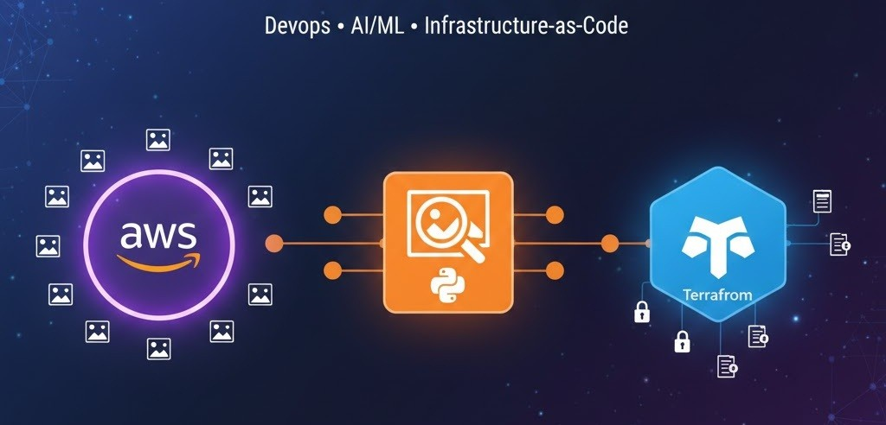
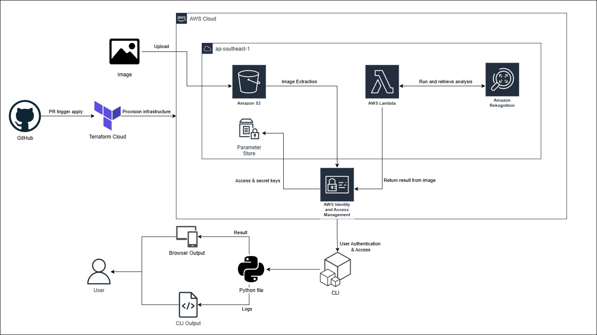
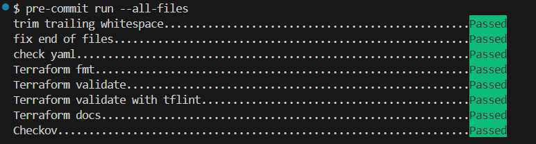
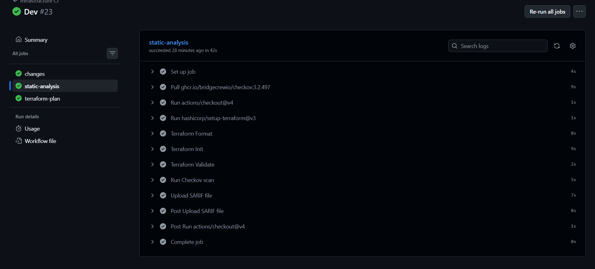
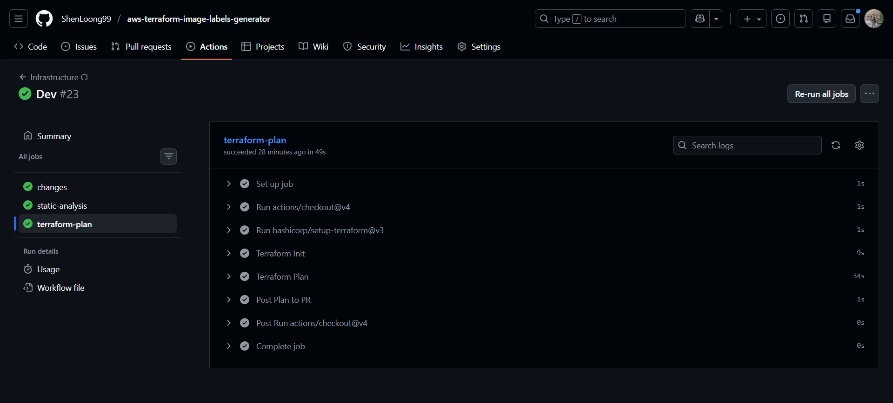
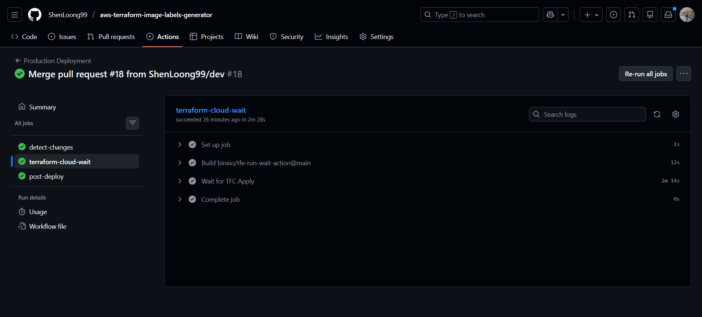
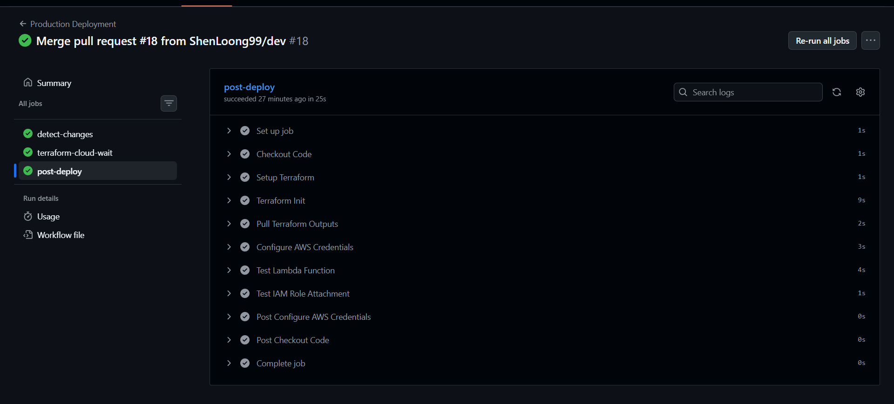
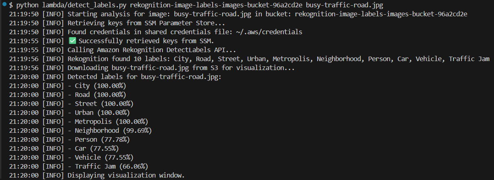
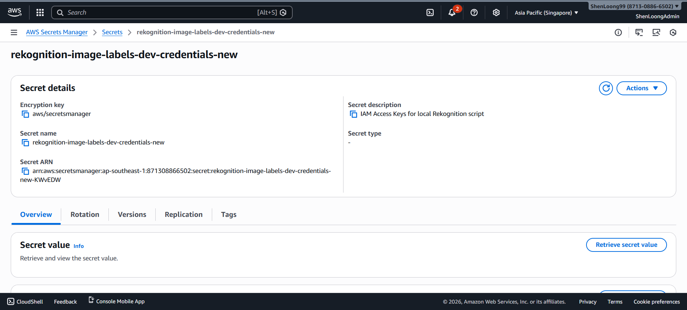

[![Contributors][contributors-shield]][contributors-url]
[![Forks][forks-shield]][forks-url]
[![Stargazers][stars-shield]][stars-url]
[![Issues][issues-shield]][issues-url]
[![Unlicense License][license-shield]][license-url]
[![LinkedIn][linkedin-shield]][linkedin-url]

<h1>📷 AWS Image Labels Generator</h1>

 

 
[![Infrastructure CI][ci-shield]][ci-url]
[![Production Deployment][cd-shield]][cd-url]
[![Update Documentation][docs-shield]][docs-url]

 

<a href="#about-the-project"><strong>Explore the docs »</strong></a>

  
Table of Contents

  <ol>
    <li><a href="#about-the-project">About The Project</a></li>
    <li><a href="#built-with">Built With</a></li>
    <li><a href="#use-cases">Use Cases</a></li>
    <li><a href="#architecture">Architecture</a></li>
    <li><a href="#file-structure">File Structure</a></li>
    <li><a href="#technical">Technical Reference</a></li>
    <li><a href="#getting-started">Getting Started</a></li>
    <li><a href="#gitops">GitOps & CI/CD Workflow</a></li>
    <li><a href="#usage">Usage</a></li>
    <li><a href="#roadmap">Roadmap</a></li>
    <li><a href="#challenges-faced">Challenges</a></li>
    <li><a href="#cost-optimization">Cost Optimization</a></li>
    <li><a href="#acknowledgements">Acknowledgements</a></li>
  </ol>

<h2 id="about-the-project">About The Project</h2>

  The <strong>AWS Image Labels Generator</strong> is a cloud-native automated solution designed to detect and catalog objects, scenes, and concepts within images. By leveraging advanced machine learning, this project allows users to upload images to a secure cloud storage environment and receive detailed metadata labels with high confidence scores.

    This project was built to demonstrate a modern <strong>GitOps workflow</strong> and <strong>Infrastructure as Code (IaC)</strong> principles using Terraform Cloud. It provides a bridge between raw image data and actionable insights, suitable for applications ranging from automated media tagging to brand coverage analysis.

  <strong>Notice:</strong> This project has been migrated from a monolithic collection at <a href="https://github.com/ShenLoong99/my-terraform-aws-projects-2025">my-terraform-aws-projects-2025</a> to this dedicated repository for better project isolation and CI/CD management. To review the full development lifecycle, including initial architectural decisions and incremental code changes, please refer to the original commit history in the source repository.

<a href="#readme-top">↑ Back to Top</a>

<h2 id="built-with">Built With</h2>

  
  
  
  
  

<ul>
  <li><strong>Terraform Cloud:</strong> Manages the VCS-driven workflow and state for the infrastructure.</li>
  <li><strong>AWS S3:</strong> Provides highly durable and scalable object storage for the source images.</li>
  <li><strong>Amazon Rekognition:</strong> A deep-learning-based service that performs the heavy lifting of image analysis and label detection.</li>
  <li><strong>AWS IAM:</strong> Ensures secure, least-privilege access for the application code to interact with AWS services.</li>
  <li><strong>Python (Boto3):</strong> The programming language and SDK used to execute the label detection logic.</li>
</ul>

<a href="#readme-top">↑ Back to Top</a>

<h2 id="use-cases">Use Cases</h2>

    Amazon Rekognition is a highly versatile service with applications across many industries. This project can be adapted for the following real-world scenarios:

<ul>
    <li><strong>Smart Surveillance Systems:</strong> Automatically recognize suspicious objects or activities on roads to enhance public safety.</li>
    <li><strong>Inventory Management:</strong> Identify and catalog products in a store environment to streamline supply chain operations.</li>
    <li><strong>Retail Analytics:</strong> Analyze customer behavior within physical stores to optimize layouts and marketing strategies.</li>
    <li><strong>Accessibility Solutions:</strong> Provide automated descriptions of surroundings to assist individuals who are visually impaired.</li>
</ul>

<a href="#readme-top">↑ Back to Top</a>

<h2 id="architecture">Architecture</h2>

  

  The system follows a serverless-inspired architecture to ensure scalability and cost-efficiency:

<ol>
  <li><strong>Infrastructure:</strong> Terraform provisions S3, Lambda, and <strong>SSM Parameter Store.</strong></li>
  <li><strong>Configuration Sync:</strong> Local CLI runs <code>sync-config.sh</code> to pull secure keys from SSM into a local <code>config.json</code>.</li>
  <li><strong>Local Analysis:</strong> User runs <code>detect_labels.py</code>. It reads <code>config.json</code>, fetches the image from S3, and calls Rekognition.</li>
  <li><strong>Health Monitoring:</strong> CloudWatch tracks Lambda execution and S3 metrics to ensure the system is healthy.</li>
</ol>

<a href="#readme-top">↑ Back to Top</a>

<h2 id="file-structure">File Structure</h2>
<pre>aws-terraform-image-labels-generator
├── .github/workflows/          # GitHub Actions CI/CD workflows
│   ├── ci.yml                  # CI: Lints, formats, and validates Terraform code
│   ├── update-readme.yml       # Auto-updates README with terraform-docs
│   └── cd.yml                  # Production deployment & verification
├── assets/                     # Architecture diagrams and UI screenshots
├── lambda/                     # Backend Logic
│   └── detect_labels.py        # Python script (Runs locally and in AWS)
│   └── function.zip            # Optimized deployment package, less than 1KB
├── scripts/                    # Automation Tooling
│   ├── setup.sh                # Initial local environment setup
│   ├── sync-config.sh          # Fetches SecureStrings from SSM to config.json
│   ├── verify-role.sh          # Post-deployment lambda role check
│   └── verify-lambda.sh        # Post-deployment lambda function name check
├── .checkov.yml                # List of rules to skip in Checkov analysis
├── .terraform.lock.hcl         # Ensures consistent provider versions across environments
├── .gitignore                  # Prevents config.json & .tfstate from being pushed
├── .pre-commit-config.yml      # Runs a series of checks (hooks) locally before every git commit
├── .tflint.hcl                 # Configuration for TFLint
├── config.json                 # Dynamic configuration of bucket names and IAM keys fetched from AWS SSM by sync-config.sh script
├── iam.tf                      # IAM Users, Groups, and Permissions
├── lambda.tf                   # Lambda function and ZIP configuration
├── main.tf                     # S3 cloudwatch error metric
├── outputs.tf                  # Exported ARNs and Names for GitOps
├── providers.tf                # AWS & Archive provider configurations
├── variables.tf                # Input variables for AWS Region and resource tagging
├── ssm.tf                      # SSM Parameter Store secure key management
├── storage.tf                  # S3 bucket configuration
├── variables.tf                # Project-wide input variables
├── README.template.md          # Manual documentation source
└── README.md                   # Auto-generated final documentation
</pre>

<a href="#readme-top">↑ Back to Top</a>

<h2 id="technical">Technical Reference</h2>
This section is automatically updated with the latest infrastructure details.

<b>Detailed Infrastructure Specifications</b>

<!-- BEGIN_TF_DOCS -->

## Requirements

| Name                                                                     | Version  |
| ------------------------------------------------------------------------ | -------- |
|  [terraform](#requirement_terraform) | >= 1.5.0 |
|  [archive](#requirement_archive)       | ~> 2.0   |
|  [aws](#requirement_aws)                   | ~> 5.0   |
|  [random](#requirement_random)          | ~> 3.0   |

## Providers

| Name                                                               | Version |
| ------------------------------------------------------------------ | ------- |
|  [archive](#provider_archive)       | 2.7.1   |
|  [aws](#provider_aws)                   | 5.100.0 |
|  [random](#provider_random)          | 3.7.2   |
|  [terraform](#provider_terraform) | n/a     |

## Modules

No modules.

## Resources

| Name                                                                                                                                                                                 | Type        |
| ------------------------------------------------------------------------------------------------------------------------------------------------------------------------------------ | ----------- |
| [aws_cloudwatch_metric_alarm.lambda_errors](https://registry.terraform.io/providers/hashicorp/aws/latest/docs/resources/cloudwatch_metric_alarm)                                     | resource    |
| [aws_iam_access_key.project_user_key](https://registry.terraform.io/providers/hashicorp/aws/latest/docs/resources/iam_access_key)                                                    | resource    |
| [aws_iam_group.developer_group](https://registry.terraform.io/providers/hashicorp/aws/latest/docs/resources/iam_group)                                                               | resource    |
| [aws_iam_group_membership.developer_team](https://registry.terraform.io/providers/hashicorp/aws/latest/docs/resources/iam_group_membership)                                          | resource    |
| [aws_iam_group_policy_attachment.group_attach](https://registry.terraform.io/providers/hashicorp/aws/latest/docs/resources/iam_group_policy_attachment)                              | resource    |
| [aws_iam_policy.rekognition_policy](https://registry.terraform.io/providers/hashicorp/aws/latest/docs/resources/iam_policy)                                                          | resource    |
| [aws_iam_policy.rekognition_s3_policy](https://registry.terraform.io/providers/hashicorp/aws/latest/docs/resources/iam_policy)                                                       | resource    |
| [aws_iam_policy.ssm_policy](https://registry.terraform.io/providers/hashicorp/aws/latest/docs/resources/iam_policy)                                                                  | resource    |
| [aws_iam_role.lambda_role](https://registry.terraform.io/providers/hashicorp/aws/latest/docs/resources/iam_role)                                                                     | resource    |
| [aws_iam_role_policy_attachment.lambda_logs](https://registry.terraform.io/providers/hashicorp/aws/latest/docs/resources/iam_role_policy_attachment)                                 | resource    |
| [aws_iam_user.project_user](https://registry.terraform.io/providers/hashicorp/aws/latest/docs/resources/iam_user)                                                                    | resource    |
| [aws_lambda_function.rekognition_lambda](https://registry.terraform.io/providers/hashicorp/aws/latest/docs/resources/lambda_function)                                                | resource    |
| [aws_s3_bucket.images_bucket](https://registry.terraform.io/providers/hashicorp/aws/latest/docs/resources/s3_bucket)                                                                 | resource    |
| [aws_s3_bucket_lifecycle_configuration.images_bucket_lifecycle](https://registry.terraform.io/providers/hashicorp/aws/latest/docs/resources/s3_bucket_lifecycle_configuration)       | resource    |
| [aws_s3_bucket_metric.bucket_logging](https://registry.terraform.io/providers/hashicorp/aws/latest/docs/resources/s3_bucket_metric)                                                  | resource    |
| [aws_s3_bucket_public_access_block.images_bucket_access](https://registry.terraform.io/providers/hashicorp/aws/latest/docs/resources/s3_bucket_public_access_block)                  | resource    |
| [aws_s3_bucket_server_side_encryption_configuration.sse](https://registry.terraform.io/providers/hashicorp/aws/latest/docs/resources/s3_bucket_server_side_encryption_configuration) | resource    |
| [aws_s3_bucket_versioning.versioning_images_bucket](https://registry.terraform.io/providers/hashicorp/aws/latest/docs/resources/s3_bucket_versioning)                                | resource    |
| [aws_ssm_parameter.access_key](https://registry.terraform.io/providers/hashicorp/aws/latest/docs/resources/ssm_parameter)                                                            | resource    |
| [aws_ssm_parameter.secret_key](https://registry.terraform.io/providers/hashicorp/aws/latest/docs/resources/ssm_parameter)                                                            | resource    |
| [random_id.bucket_id](https://registry.terraform.io/providers/hashicorp/random/latest/docs/resources/id)                                                                             | resource    |
| [terraform_data.setup_script](https://registry.terraform.io/providers/hashicorp/terraform/latest/docs/resources/data)                                                                | resource    |
| [archive_file.lambda_zip](https://registry.terraform.io/providers/hashicorp/archive/latest/docs/data-sources/file)                                                                   | data source |

## Inputs

| Name                                                                  | Description                    | Type     | Default                      | Required |
| --------------------------------------------------------------------- | ------------------------------ | -------- | ---------------------------- | :------: |
|  [aws_region](#input_aws_region)       | AWS region to deploy resources | `string` | `"ap-southeast-1"`           |    no    |
|  [project_name](#input_project_name) | Project name prefix            | `string` | `"rekognition-image-labels"` |    no    |

## Outputs

| Name                                                                                                           | Description                                                |
| -------------------------------------------------------------------------------------------------------------- | ---------------------------------------------------------- |
|  [access_key_path](#output_access_key_path)                               | SSM access key for local config.json                       |
|  [aws_region](#output_aws_region)                                              | The AWS region where resources are deployed                |
|  [lambda_execution_role_arn](#output_lambda_execution_role_arn) | IAM role ARN assumed by Lambda for S3 + Rekognition access |
|  [lambda_function_name](#output_lambda_function_name)                | Rekognition Lambda function name                           |
|  [lambda_role_name](#output_lambda_role_name)                            | IAM role name for Lambda                                   |
|  [s3_bucket_name](#output_s3_bucket_name)                                  | S3 bucket name for image uploads                           |
|  [secret_key_path](#output_secret_key_path)                               | SSM secret key for local config.json                       |

<!-- END_TF_DOCS -->

<a href="#readme-top">↑ Back to Top</a>

<h2 id="getting-started">Getting Started</h2>
<h3>Prerequisites</h3>
<ul>
    <li>An active <strong>AWS Account</strong>.</li>
    <li><strong>Terraform Cloud</strong> for IaC deployment.</li>
    <li><strong>Python 3.x</strong> installed locally for running the detection script.</li>
    <li><strong>Set your AWS Region:</strong> Set to whatever <code>aws_region</code> you want in <code>variables.tf</code>.</li>
</ul>

<h3>Terraform Cloud State Management</h3>
<ol>
   <li>Create a new <strong>Workspace</strong> with github version control workflow in Terraform Cloud.</li>
   <li>In the Variables tab, add the following <strong>Terraform Variables:</strong>
   </li>
   <li>
    Add the following <strong>Environment Variables</strong> (AWS Credentials):
    <ul>
      <li><code>AWS_ACCESS_KEY_ID</code></li>
      <li><code>AWS_SECRET_ACCESS_KEY</code></li>
   </ul>
   </li>
    <li>
      Run the command ni Terraform CLI:
      <pre>terraform login</pre>
    </li>
    <li>Create a token and follow the steps in browser to complete the Terraform Cloud Connection.</li>
    <li>
      Add the <code>backend</code> block in <code>terraform</code> code block</code>:
    <pre>backend "remote" {
  hostname     = "app.terraform.io"
  organization = &lt;your-organization-name&gt;
  workspaces {
    name = &lt;your-workspace-name&gt;
  }
}</pre>
   </li>
    <li>
      Run the command in Terraform CLI to migrate the state into Terraform Cloud:
      <pre>terraform init -migrate-state</pre>
    </li>
</ol>

<h3>Installation & Deployment</h3>
<ol>
    <li>
        <strong>Clone the Repository:</strong>
        <pre>git clone https://github.com/ShenLoong99/aws-terraform-image-labels-generator.git</pre>
    </li>
    <li>
        <strong>Provision Infrastructure:</strong> 
        <strong>Terraform Cloud</strong> → <strong>Initialize & Apply:</strong> Push your code to GitHub. Terraform Cloud will automatically detect the change, run a <code>plan</code>, and wait for your approval.
    </li>
    <li>
        <strong>Observe workflow:</strong> 
        <strong>GitHub (GitOps)</strong> → <strong>Github actions:</strong> Observe the process/workflow of CI/CD in the actions tab in GitHub.
    </li>
</ol>

<a href="#readme-top">↑ Back to Top</a>

<h2 id="gitops">GitOps & CI/CD Workflow</h2>

This project uses a fully automated GitOps pipeline to ensure code quality and deployment reliability. The <strong>Pre-commit</strong> framework implements a "Shift-Left" strategy, ensuring that code is formatted, documented, and secure before it ever leaves your machine.

<h3>Workflow Files</h3>
<ol>
  <li>
    <strong>Pre-commit</strong>
    <ul>
      <li><strong>Tool:</strong> Executes <code>terraform fmt</code>, <code>terraform validate</code>, <code>TFLint</code>, <code>terraform_docs</code> and <code>checkov</code> to ensure the code is clean.</li>
      <li><strong>Trigger:</strong> Runs on every <strong>git commit</strong>.</li>
      <li>
        <strong>Outcome:</strong> If any check fails, the commit is blocked. You fix the error, re-add the file, and commit again. 
        
      </li>
    </ul>
  </li>
  <li>
    <strong>Continuous Integration (PR)</strong>
    <ul>
      <li><strong>Tool:</strong> Executes <code>terraform fmt -check</code>, <code>terraform validate</code> and <code>checkov</code>, then do <code>plan</code> and cost estimation and print it on PR.</li>
      <li><strong>Trigger:</strong> Runs on every <strong>Pull Request</strong>.</li>
      <li>
        <strong>Outcome:</strong> This acts as the "Gatekeeper" before code is merged to <code>main</code>. 
        
        
      </li>
    </ul>
  </li>
  <li>
    <strong>Continuous Delivery (Deployment)</strong>
    <ul>
      <li><strong>Tool:</strong> Terraform Cloud + GitHub Actions OIDC.</li>
      <li><strong>Trigger:</strong> Merges to the <code>main</code> branch.</li>
      <li>
        <strong>Outcome:</strong> The pipeline verifies the infrastructure state and runs a post-deployment health check (<code>verify-lambda.sh</code> & <code>verify-role.sh</code>) to confirm the Rekognition service is responding. 
        
        
      </li>
    </ul>
  </li>
</ol>

<h3>Prerequisites for GitOps</h3>
<ul>
  <li><strong>Repository Secret <code>TF_API_TOKEN</code>:</strong> Required for GitHub to communicate with Terraform Cloud.</li>
  <li><strong>Trigger:</strong> A GitHub Actions OIDC role (<code>GitHubActionRole</code>) allows the runner to verify AWS resources without long-lived keys.</li>
</ul>

<h2 id="usage">Usage & Testing</h2>

  To generate labels for an image, follow these steps:

<ol>
  <li>
      <strong>Run the scripts to sync configuration locally:</strong> 
      <pre>bash ./scripts/sync-config.sh</pre>
  </li>
  <li>
    Upload an image (e.g., <code>cats.jpg</code>) to the S3 bucket created by Terraform. 
    <pre>aws s3 cp &lt;your-image-file-name&gt; s3://&lt;your-s3-bucket-name&gt;</pre>
    
  </li>
  <li>
    <strong>Run the analysis:</strong> 
    <pre>python lambda/detect_labels.py &lt;s3-bucket-name&gt; &lt;your-image-file-name&gt;</pre>
  </li>
  <li>
    <strong>View Logs:</strong> The logs will appear instantly in your VS Code terminal. 
    
  </li>
  <li>
    <strong>View Results:</strong> A browser window pops up after the analysis is finished. 
    
  </li>
</ol>

<a href="#readme-top">↑ Back to Top</a>

<h2 id="roadmap">Project Roadmap</h2>
<ul>
  <li>[x] <strong>Storage Setup:</strong> Create a private Amazon S3 bucket to act as the central repository for your source images.</li>
  <li>[x] <strong>Environment Config:</strong> Install and configure the AWS CLI and Python environment (boto3, Pillow) to communicate with cloud services.</li>
  <li>[x] <strong>Logic Development:</strong> Develop the Python script using the detect_labels function to send images to Amazon Rekognition.</li>
  <li>[x] <strong>Execution & Verification:</strong> Run the script to generate metadata tags and verify object detection results with bounding boxes.</li>
  <li>[x] <strong>GitOps Automation:</strong> Implement pre-commit hooks and GitHub Actions to automate code quality, security scanning, and documentation.</li>
</ul>

<a href="#readme-top">↑ Back to Top</a>

<h2 id="challenges-faced">Challenges</h2>
<table>
    <thead>
        <tr>
            <th>Challenge</th>
            <th>Solution</th>
        </tr>
    </thead>
    <tbody>
        <tr>
            <td><strong>Lambda Zip Too Large</strong></td>
            <td>
                Removed <code>Pillow/Matplotlib</code> bloat; switched to passing S3 references directly to Rekognition (reduced size from 70MB to <1KB).
            </td>
        </tr>
        <tr>
            <td><strong>Dynamic <code>for_each</code> Errors</strong></td>
            <td>
                Using dynamic resource ARNs (known only after apply) as for_each keys caused plan failures. Solution: Refactored IAM policy attachments to use a Map with Static Keys, ensuring resource addresses are predictable during the plan phase.
            </td>
        </tr>
        <tr>
            <td><strong>Timeout Issues</strong></td>
            <td>
                Optimized performance by increasing <strong>Memory (256MB)</strong> and <strong>Timeout (10s)</strong> in Terraform to handle high-res image latency.
            </td>
        </tr>
        <tr>
            <td><strong>Security Risks of Long-Lived Keys</strong></td>
            <td>
                Migrated secrets to AWS SSM Parameter Store as SecureString and implemented a <code>sync-config.sh</code> script to fetch them securely into a git-ignored <code>config.json</code>. 
                
            </td>
        </tr>
        <tr>
          <td><strong>GitOps: Documentation Drift</strong></td>
          <td>
            Integrated <code>terraform-docs</code> into a <strong>GitHub Action</strong> and <strong>Pre-commit hook</strong> to automatically inject technical specs into the README on every commit.
          </td>
        </tr>
        <tr>
          <td><strong>GitOps: Configuration Drift</strong></td>
          <td>
            Enforced a <strong>Push-based GitOps flow</strong> using Terraform Cloud; any manual changes are automatically overwritten or flagged during the next automated <code>terraform plan</code>.
          </td>
        </tr>
        <tr>
          <td><strong>Commit Interruption (Broken Hooks)</strong></td>
          <td>
            Standardized hook naming and versions in <code>.pre-commit-config.yml</code> to ensure consistent local environments.
          </td>
        </tr>
        <tr>
          <td><strong>Security Misconfigurations</strong></td>
          <td>
            Implemented <strong>Checkov</strong> scanning in both local pre-commit hooks and the GitHub CI pipeline to act as a security gate.
          </td>
        </tr>
        <tr>
          <td><strong>Local Environment Parity</strong></td>
          <td>
            Pre-commit hooks failed locally due to missing system binaries (<code>Checkov</code>/<code>terraform-docs</code>).
          </td>
        </tr>
    </tbody>
</table>

<a href="#readme-top">↑ Back to Top</a>

<h2 id="cost-optimization">Cost Optimization (Free Tier)</h2>

  To keep the project budget-friendly, the following strategies are implemented or recommended:

<ul>
  <li><strong>S3 Lifecycle Policies:</strong> Automatically transition images to <em>S3 Standard-IA</em> or <em>Glacier</em> after 30 days of inactivity to reduce storage costs.</li>
  <li><strong>Confidence Thresholds:</strong> By setting a <code>MIN_CONFIDENCE</code> level (e.g., 70%), we filter out low-certainty results, reducing unnecessary data processing.</li>
  <li><strong>Free Tier Utilization:</strong> Amazon Rekognition and S3 both offer free tier limits for the first 12 months, which this project stays within for light usage.</li>
  <li><strong>Manual Apply in TFC:</strong> Utilize Terraform Cloud Version Control Workflow to prevent accidental resource creation and associated costs.</li>
  <li><strong>Serverless Execution:</strong> By using Lambda instead of a local environment, you only pay for the milliseconds the code is actually running (1M free requests/month).</li>
</ul>

<a href="#readme-top">↑ Back to Top</a>

<h2 id="acknowledgements">Acknowledgements</h2>

  Special thanks to <strong>Tech with Lucy</strong> for the architectural inspiration and excellent AWS tutorials that helped shape this pipeline.

<ul>
  <li>
    See her youtube channel here: <a href="https://www.youtube.com/@TechwithLucy" target="_blank">Tech With Lucy</a>
  </li>
  <li>
    Watch her video here: <a href="https://www.youtube.com/watch?v=hiE0El3zs1Y" target="_blank">5 Beginner AWS Cloud Projects To Get You Hired (2025)</a>
  </li>
</ul>

<a href="#readme-top">↑ Back to Top</a>

[contributors-shield]: https://img.shields.io/github/contributors/ShenLoong99/aws-terraform-image-labels-generator.svg?style=for-the-badge
[contributors-url]: https://github.com/ShenLoong99/aws-terraform-image-labels-generator/graphs/contributors
[forks-shield]: https://img.shields.io/github/forks/ShenLoong99/aws-terraform-image-labels-generator.svg?style=for-the-badge
[forks-url]: https://github.com/ShenLoong99/aws-terraform-image-labels-generator/network/members
[stars-shield]: https://img.shields.io/github/stars/ShenLoong99/aws-terraform-image-labels-generator.svg?style=for-the-badge
[stars-url]: https://github.com/ShenLoong99/aws-terraform-image-labels-generator/stargazers
[issues-shield]: https://img.shields.io/github/issues/ShenLoong99/aws-terraform-image-labels-generator.svg?style=for-the-badge
[issues-url]: https://github.com/ShenLoong99/aws-terraform-image-labels-generator/issues
[license-shield]: https://img.shields.io/github/license/ShenLoong99/aws-terraform-image-labels-generator.svg?style=for-the-badge
[license-url]: https://github.com/ShenLoong99/aws-terraform-image-labels-generator/blob/master/LICENSE.txt
[linkedin-shield]: https://img.shields.io/badge/-LinkedIn-black.svg?style=for-the-badge&logo=linkedin&colorB=555
[linkedin-url]: https://www.linkedin.com/in/si-kai-tan/
[ci-shield]: https://github.com/ShenLoong99/aws-terraform-image-labels-generator/actions/workflows/ci.yml/badge.svg
[ci-url]: https://github.com/ShenLoong99/aws-terraform-image-labels-generator/actions/workflows/ci.yml
[cd-shield]: https://github.com/ShenLoong99/aws-terraform-image-labels-generator/actions/workflows/cd.yml/badge.svg
[cd-url]: https://github.com/ShenLoong99/aws-terraform-image-labels-generator/actions/workflows/cd.yml
[docs-shield]: https://github.com/ShenLoong99/aws-terraform-image-labels-generator/actions/workflows/update-readme.yml/badge.svg
[docs-url]: https://github.com/ShenLoong99/aws-terraform-image-labels-generator/actions/workflows/update-readme.yml
